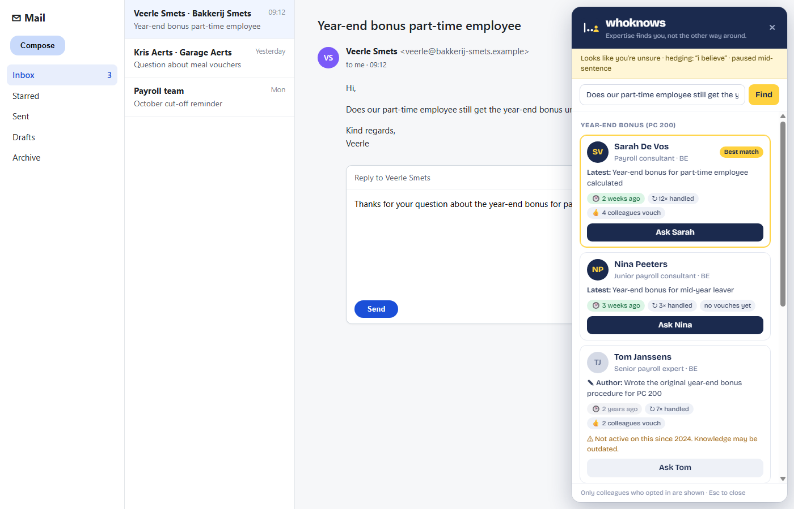
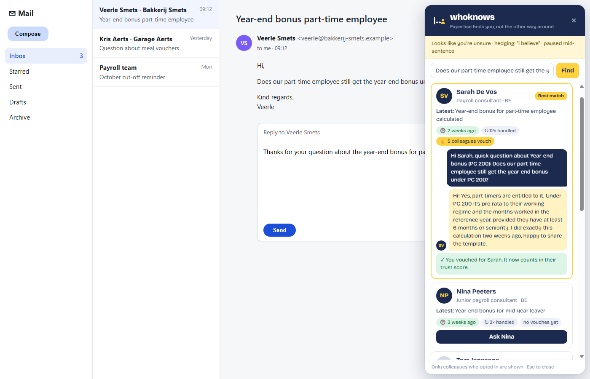
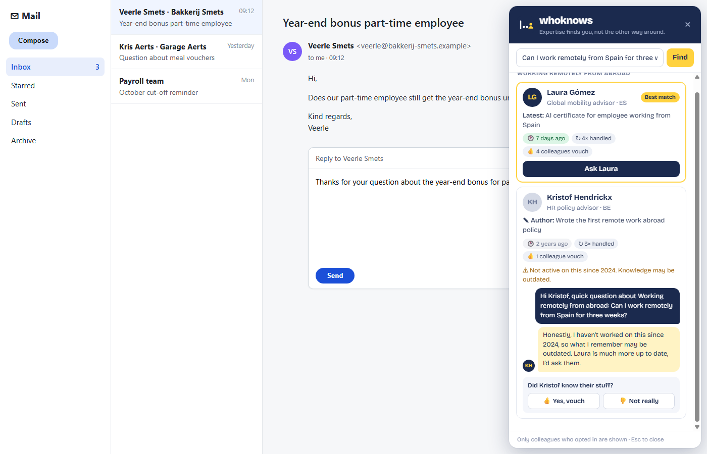

<p align="center"></p>

<h1 align="center">whoknows</h1>
<p align="center"><b>Expertise finds you, not the other way around.</b><br>
SD Worx challenge · Tectonic Hackathon 2026 · <i>Unlock the Knowledge Within: Find it. Understand it. Trust it.</i></p>

---

You're replying to a customer. You type *"I believe that…"*, stop, delete the word. You're not sure.

**whoknows** notices that moment of doubt and, right there in Gmail, shows which colleagues know the answer, **and how far you can trust them**: how recently they worked on it, how often, and how many colleagues vouch for them. Ask them in one click, get their answer, and tell whoknows whether they knew their stuff. That feedback makes the next answer more trustworthy for everyone.

| Doubt detected while typing | Ask, get the answer, vouch | Stale knowledge flagged |
|---|---|---|
|  |  |  |

## Why this fits the challenge

SD Worx asked for a focused PoC that takes someone from *"I found something"* to *"I understand why I can trust it"*. whoknows covers one role (the consultant answering clients), one workflow (replying to a question) and one trust signal done well: **trust in people**.

| Challenge theme | What whoknows does |
|---|---|
| **Detect** | Detects hesitation while you write (pauses, rewrites, hedging like "I think" or "denk ik") and detects **knowledge gaps**: topics where nobody has recent expertise. |
| **Connect** | Brings the right colleague to you, inside the tool you already use. No search box, no extra tab. |
| **Trust** | Every expert comes with evidence and trust signals: recency, frequency, peer vouches. Outdated experts are flagged ("not active on this since 2024") instead of silently ranked. |
| **Capture** | After an expert answers, you vouch whether they knew their stuff. That feedback feeds straight back into the ranking. |

**What's different from a people finder:** it's *push, not pull* (expertise comes to you at the moment of doubt), and it shows *how far you can trust* someone, not just *who*.

## How it works

```
Chrome extension (Manifest V3, WXT + TypeScript)          Backend (FastAPI, Python)
┌─────────────────────────────────────────────┐          ┌───────────────────────────────────┐
│ content script                              │  text    │ POST /analyze                     │
│  • doubt score from typing behaviour        │ ───────► │   topic detection (EN + NL)       │
│  • reads your reply + the thread (Gmail)    │          │   hedging detection               │
│                                             │          │ POST /experts                     │
│ side panel (shadow DOM)                     │ experts  │   ranking + trust signals         │
│  • expert cards with trust signals          │ ◄─────── │   consent filter (server-side)    │
│  • ask → answer → vouch                     │          │ POST /feedback                    │
│  • "Not sure?" nudge                        │ ───────► │   signed expert refs, votes       │
└─────────────────────────────────────────────┘          └───────────────────────────────────┘
          background service worker is the only component that talks to the API
```

### Doubt detection

Every signal adds to a doubt score. At 2 points whoknows analyses your draft plus the message you're replying to.

| Signal | Points |
|---|---|
| Hedging language: "I believe", "not sure", "probably", "denk ik", "volgens mij", … (40+ EN/NL phrases) | +2 |
| Paused mid-sentence (2.5 s) | +1 |
| Long pause (6 s) | +1 / +2 |
| Deleted text right after a pause | +2 |
| Deleted a chunk of text | +2 |
| Rewrote the same draft several times | +1 |

If a known topic is found, the panel slides in. If not (or you already dismissed it), a small **"Not sure?"** nudge appears instead, so it never gets in your way.

### Ranking and trust

```
score = relevance (overlap with the expert's evidence)
      + 3.0 × recency   (exponential decay, 120-day half-life)
      + 1.0 × log(1 + times handled)
      + 0.6 × log(1 + peer vouches)
      − 0.8 × log(1 + "didn't know" votes)

opted out / topic hidden  → never returned by the API
not active for > 1 year   → flagged as outdated
best score below 2.5      → "knowledge gap"
```

The expert card always shows *why* someone is ranked: their most recent (or authored) piece of work, how long ago, how many times, and how many colleagues vouch for them.

### Ask and vouch

"Ask Sarah" opens a message pre-filled with the question you're answering (taken from the thread), which you can edit. Sarah's answer appears in the panel. If you closed the panel in the meantime, a "Sarah replied" nudge brings you back. Then: **"Did Sarah know their stuff?"** A yes counts as a vouch on that topic, a no lowers her ranking on it.

## Security and privacy

A tool that knows what your colleagues know is sensitive by design. These are the controls we built in, each backed by code and tests.

**Consent, enforced server-side**
- Employees opt in. People who opt out, or hide specific topics, are filtered in the backend before ranking (`backend/app/ranking.py → visible_evidence`), so their data never leaves the server. It's not just hidden in the UI.

**No IDOR, minimal data exposure**
- The API never exposes internal employee IDs, and never exposes *who* vouched for whom, only counts.
- Feedback uses an **opaque expert reference**: an HMAC-SHA256 of (employee, topic) with a server secret (`WHOKNOWS_SECRET`). The server resolves it only among the people it would show for that topic. You can't vote for an arbitrary employee, for someone who opted out, or reuse a reference across topics (`backend/app/feedback.py`).
- There are no per-employee endpoints: you can't enumerate the company.

**Input validation**
- All request bodies go through Pydantic: text is limited to 4,000 characters, topic IDs must match `^[a-z0-9_]{1,64}$`, refs must match `^[0-9a-f]{32}$`. Unknown topics or experts return 404.

**Hardened responses**
- Every response carries `X-Content-Type-Options: nosniff`, `X-Frame-Options: DENY`, `Referrer-Policy: no-referrer` and `Cache-Control: no-store`.
- The backend binds to `127.0.0.1` only.

**Extension**
- **No XSS path:** all backend data is rendered with `textContent`/DOM APIs, never `innerHTML`. That's also why it runs under Gmail's Trusted Types policy.
- **Isolated UI:** the panel lives in a shadow root, so page CSS and scripts can't restyle or spoof it. Keystrokes inside the panel are stopped from reaching page handlers.
- **Least privilege:** host permissions are only the whoknows API; permissions are only `storage`. Only the background worker talks to the API, never the page.
- **Minimal data use:** text is only sent after a doubt signal, never on every keystroke. Password fields and regular inputs are ignored (only `textarea`/`contenteditable`). Quoted history and signatures in Gmail are stripped before analysis.

**Secrets and data hygiene**
- No secrets in the repo: `.env*` is git-ignored, and the HMAC secret comes from the environment (random per process if unset).
- All people and data in this repo are fictional.

**Tests** (`backend/tests/test_api.py`, run with `npm run backend:test`):

| Test | Guarantees |
|---|---|
| `test_opt_out_never_returned` | Opted-out employee never appears, for any topic |
| `test_hidden_topic_respected` | Hidden topics are enforced server-side |
| `test_no_internal_ids_leak` | No employee IDs in API responses |
| `test_feedback_rejects_foreign_refs` | Refs can't be forged, reused across topics, or target opted-out people |
| `test_input_validation` | Path-like IDs, unknown topics and oversized input are rejected |
| `test_feedback_counts_as_vouch`, `test_unhelpful_lowers_score` | Vouching changes trust as intended |
| `test_sarah_ranks_first_and_tom_is_stale`, `test_knowledge_gap`, `test_analyze_finds_topic_and_hedge` | Ranking, staleness and gap detection |

Aikido scan: see the before/after screenshots in the Builderbase submission.

## Run it

**Requirements:** Python 3.11+, Node 20+, Chrome.

```bash
# Backend (Windows shortcuts)
npm run backend:setup      # once: creates backend/.venv and installs dependencies
npm run backend            # http://127.0.0.1:8000

# macOS / Linux
cd backend && python -m venv .venv && source .venv/bin/activate
pip install -r requirements.txt && uvicorn app.main:app --host 127.0.0.1 --port 8000
```

```bash
# Extension
npm install
npm run build              # then chrome://extensions → Developer mode → Load unpacked → .output/chrome-mv3
```

Open Gmail (or the demo inbox at <http://127.0.0.1:8000/demo/mail.html>), reply to a mail and start typing.

```bash
npm run backend:test       # security + ranking tests
```

## The data

`backend/data/company.json` describes a fictional HR and payroll company: **34 consultants, 34 topics, 233 pieces of evidence** (tickets, documents, chats) across Belgium, the Netherlands, Germany, France, Spain and the UK. It's generated deterministically by `backend/scripts/generate_data.py`, with deliberate patterns:

- **Sarah De Vos**: the go-to person for year-end bonuses (12 cases, last one 2 weeks ago, 4 vouches).
- **Tom Janssens**: wrote the original procedure, but hasn't worked on it since 2024, so he's flagged as outdated.
- **Lotte Maes**: an expert who opted out, so she never appears.
- **Pieter Claes**: hides one topic (sick leave).
- **Luxembourg cross-border workers**: nobody has recent expertise, so it's a knowledge gap.

## Scope of this PoC and next steps

Built in one afternoon, deliberately focused:

- **Topic detection** uses weighted EN/NL keyword matching over 34 topics. It's fast, explainable and predictable. Next: embeddings.
- **Expert answers** come from each topic's answer in the knowledge base. Next: deliver the question through Teams/Outlook and capture the real reply.
- **Votes** are kept in backend memory for the session. Next: persist them in a database.
- **Authentication** isn't included: the backend runs locally. Next: SSO so votes and consent are tied to the signed-in employee.
- **Gmail** support relies on Gmail's current page structure. Next: Outlook web and Teams.
- **info@ routing** is a future use: the same engine could route incoming client mails to the right consultant.

## Tech

WXT · TypeScript · React (popup) · Chrome Manifest V3 · FastAPI · Pydantic · pytest
